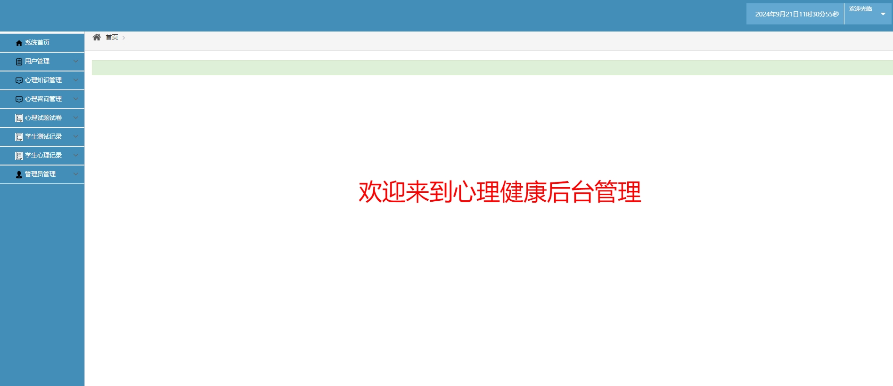
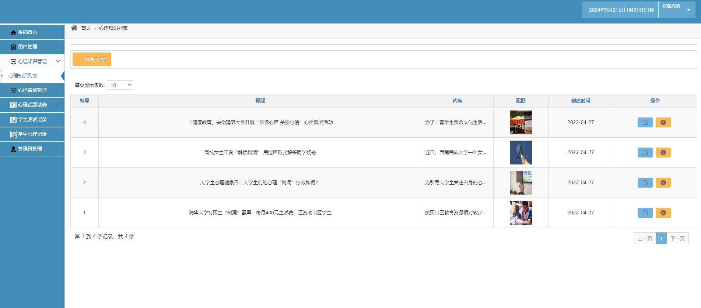
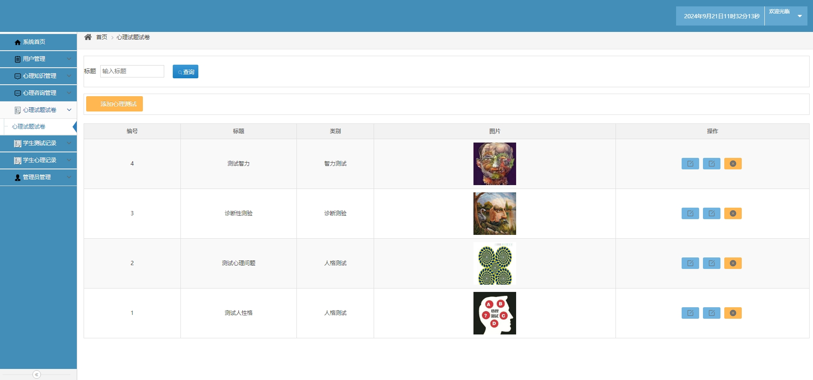
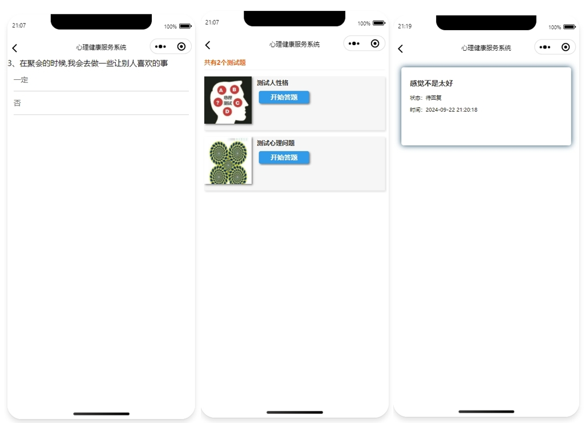
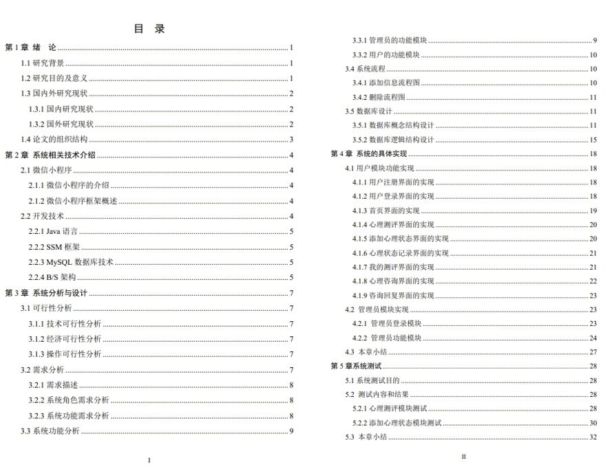

# 1.项目简介
- 测试环境：idea2022，Tomcat8.5，MySQL5.7，Navicat，Maven，微信小程序开发工具
-技术选型：SSM，JSP，MySQL，原生微信小程序

# 2.系统部署
## 2.1 后端部署
- 首先通过navicat创建数据库xljk，导入数据库sql文件，按照本地环境，修改项目中src/main/resources/jdbc.properties中的1-4行
- 通过idea打开项目xljk，注意是Maven项目
- 创建本地Tomcat Server，注意路径配置为http://localhost:8080/xljk/（小程序请求的地址是这个，当然这个是随意改的，前提是你会修改）
- 启动tomcat，管理web地址：http://localhost:8080/xljk/hlogin/viewlogin  账号密码：admin/123456

## 2.2 小程序部署
- 打开微信开发工具
- 导入小程序项目，appid选择测试号即可
- 注册个账号，然后登录，注意登录账号是“学号”！！！！，不是nickname！！！！

# 3.项目部分截图

# 4.获取方式
[戳我查看](https://gitee.com/aven999/mall)